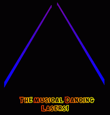



## MUSICAL Lasers\! \- Real Magic\!

### Description

Magical Dancing MUSIC Lasers which dance according to

a SONG!! The code detects audio frequency from the

sound card and makes the LASERS ROCK!!!

Real LIFE EFFECT and the fast moving lasers create

an illusion!!

1st, run winamp, PLAY A SONG, Keep it Running, and then

Run the Magic lasers!
 
### More Info
 
Lasers :)

             |
---                |---
**Submitted On**   |2003-05-30 16:13:32
**By**             |[Kailash Nadh](https://github.com/Planet-Source-Code/PSCIndex/blob/master/ByAuthor/kailash-nadh.md)
**Level**          |Intermediate
**User Rating**    |5.0 (25 globes from 5 users)
**Compatibility**  |VB 3\.0, VB 4\.0 \(16\-bit\), VB 4\.0 \(32\-bit\), VB 5\.0, VB 6\.0
**Category**       |[Sound/MP3](https://github.com/Planet-Source-Code/PSCIndex/blob/master/ByCategory/sound-mp3__1-45.md)
**World**          |[Visual Basic](https://github.com/Planet-Source-Code/PSCIndex/blob/master/ByWorld/visual-basic.md)
**Archive File**   |[MUSICAL\_La159478612003\.zip](https://github.com/Planet-Source-Code/kailash-nadh-musical-lasers-real-magic__1-45865/archive/master.zip)

